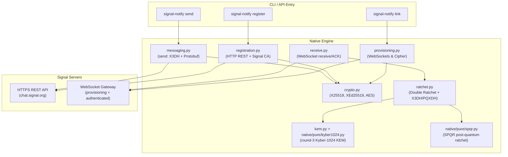

# Technical Reference & Protocol Design

This document describes the native Python engine of `signal-notify`. It operates without binary wrappers (like `libsignal-client` Rust bindings) or JVM processes — the entire protocol, including the post-quantum primitives, is pure Python.

---

## 1. Native Client Engine Architecture

`signal-notify` uses a standard Python stack: `cryptography` (asymmetric X25519 and symmetric AES/HMAC) and `websockets` (transport). The two post-quantum primitives Signal mandates are implemented in pure Python under `native/pure/` — `mlkem768.py`/`kyber1024.py` (ML-KEM-768 and round-3 Kyber-1024 KEMs) and `spqr.py` (SPQR ratchet, with `_pb.py` and `spqr_gf.py` helpers) — validated byte-for-byte against Signal's own Rust libraries (kept under `rust/` as test-only oracles; see [Caveats #19](native_caveats.md)). No Rust toolchain, no JVM, no subprocess.



All service traffic goes to `chat.signal.org` (the legacy
`textsecure-service.whispersystems.org` host is dead) and is verified against
Signal's **pinned root CA**, bundled as `native/signal-ca.pem` and loaded by
`registration.signal_ssl_context()` (the public trust store rejects Signal's
cert).

---

## 2. Cryptographic Protocols & Flows

The client implements two main protocols: **X3DH** for key agreement and the **Double Ratchet** for symmetric message encryption.

### A. Extended Triple Diffie-Hellman (X3DH)
When sending a message to a recipient for whom no local session exists, the client fetches the recipient’s public key bundle from `GET /v2/keys/{recipient}/*` and performs X3DH to compute a shared secret:

1. **Parameters:**
   * $IK_A$: Our Identity Key (X25519 public key)
   * $EK_A$: Our Ephemeral Key (generated per-session)
   * $IK_B$: Recipient's Identity Key
   * $SPK_B$: Recipient's Signed Prekey
   * $OPK_B$: Recipient's One-Time Prekey (optional)

2. **Diffie-Hellman Agreement Exchanges:**
   * $DH1 = \text{ECDH}(IK_A, SPK_B)$
   * $DH2 = \text{ECDH}(EK_A, IK_B)$
   * $DH3 = \text{ECDH}(EK_A, SPK_B)$
   * $DH4 = \text{ECDH}(EK_A, OPK_B)$ (executed only if $OPK_B$ is present in the bundle)

3. **Master Secret Derivation:**
   $$SS = DH1 \mathbin{\Vert} DH2 \mathbin{\Vert} DH3 \mathbin{\Vert} DH4$$
   The shared master secret is passed through HKDF-SHA256 with info `b"WhisperText"` and a salt of 32 zero-bytes to derive the initial Root Key ($RK$) and Chain Key ($CK$):
   $$(RK, CK) = \text{HKDF-SHA256}(SS, \text{salt}=0^{32}, \text{info}=\text{b"WhisperText"})$$

> **Send vs. receive.** The **send** path (`messaging.py`) is the *initiator*
> (`§2.A`/`§2.B` below) using the same Double Ratchet engine (`ratchet.py`). The
> **receive** path (`ratchet.py`, `§7`) is the *responder*: it implements the
> full Double Ratchet (receiving chain, DH-ratchet, skipped-message-key store)
> plus responder X3DH **and** post-quantum **PQXDH**, following libsignal's
> constructions so it interoperates with the phone.

### B. Double Ratchet Sending Chain (initiator / send)
The **send** path steps the **Symmetric Ratchet (Sending Chain)** forward to derive keys for each outgoing message. The DH Ratchet remains stationary (using our established session ephemeral key) — sufficient for one-way self-notification.

1. **Symmetric Step:**
   For each message, we step the chain key:
   * $\text{Message Key (MK)} = \text{HMAC-SHA256}(CK, \text{b"\x01"})$
   * $\text{Next Chain Key (CK)} = \text{HMAC-SHA256}(CK, \text{b"\x02"})$

2. **Message Keys Derivation:**
   From the derived $MK$, we run HKDF-SHA256 with info `b"WhisperMessageKeys"` to derive the AES encryption key, HMAC key, and IV:
   $$(AES\_Key, HMAC\_Key, IV) = \text{HKDF-SHA256}(MK, \text{salt}=0^{32}, \text{info}=\text{b"WhisperMessageKeys"})$$

---

## 3. Message Serialization & Serialization Formats

### A. Protobuf Schemas
Outgoing payloads are serialized using custom lightweight binary encoders. The hierarchy is:

1. **`Content` Message:**
   Represents the decrypted payload content. Contains either a `DataMessage` or a `SyncMessage`.
   * Field 1: `DataMessage` (used for direct messages to peers)
   * Field 2: `SyncMessage` (used to wrap Note-to-Self messages)
   * **No padding field.** Padding is applied at the byte level *after* the
     protobuf (see §3.B). **Do not** put padding in a `Content` field — field 8 is
     `decryptionErrorMessage`, and a client that sees it treats the whole message
     as an error notice and never displays it. (This exact mistake blocked display
     for a long time — see [Caveats #2](native_caveats.md).)

2. **`SyncMessage.Sent`** (Note-to-Self — the transcript a linked device emits so
   the message renders on the primary). Field numbers verified against a live
   capture of the phone's own Note-to-Self:
   * Field 1: `destinationE164` (string, our own number)
   * Field 2: `timestamp` (varint)
   * Field 3: `DataMessage` bytes
   * Field 4: `expirationStartTimestamp` (varint, = timestamp)
   * Field 6: `isRecipientUpdate` (varint, = 0)
   * Field 12: `destinationServiceIdBinary` (bytes, 16-byte ACI UUID)
   * (`unidentifiedStatus`, field 5, is populated only for sealed-sender
     recipients and is absent for Note-to-Self.)

3. **`DataMessage`:**
   * Field 1: `body` (string)
   * Field 5: `expireTimer` (varint, = 0)
   * Field 6: `profileKey` (bytes, 32 — required for the primary to attribute the message)
   * Field 7: `timestamp` (varint)
   * Field 12: `requiredProtocolVersion` (varint, = 0)
   * Field 23: `expireTimerVersion` (varint, = 1)

### B. Transport Padding (byte-level, not a protobuf field)

To obscure message sizes, Signal pads the serialized `Content` at the **byte
level**, exactly as `PushTransportDetails.getPaddedMessageBody` does — **not** as
a protobuf field (`messaging.push_pad()`):

1. Append a single **`0x80`** boundary marker after the serialized `Content`.
2. Append `0x00` bytes to a block boundary.

The padded length is `getPaddedMessageLength(len(content)+1) - 1`, i.e.

$$\text{padded\_len} = \left\lceil \frac{\text{len}(content)+2}{B} \right\rceil \times B - 1$$

where the block size is **`B = PADDING_BLOCK_SIZE = 80`** in the current app.
(The archived `libsignal-service-java` used 160; the constant changed — always
verify against a live capture, and note the `0x80` marker is what the receiver
scans back to when stripping.) The receiver strips this in
`receive._strip_push_padding`.

> ⚠️ An earlier version of this engine padded by appending a `Content` protobuf
> field instead — which happens to be `decryptionErrorMessage`. That made every
> message invisible on the phone. See [Caveats #2](native_caveats.md).

### C. Envelope Packaging
1. **AES-256-CBC Encryption:** The padded `Content` bytes are padded using PKCS7 to a multiple of 16 bytes and encrypted with the message $AES\_Key$ and $IV$.
2. **SignalMessage Protobuf:** The ciphertext is wrapped in a `SignalMessage`,
   prefixed by a **version byte `0x44`** (v4 — the message-version nibble in the
   high bits):
   * Field 1: Sender ratchet public key (`0x05`-prefixed, **33 bytes** — never raw 32; see [Caveats #3](native_caveats.md))
   * Field 2: Counter (varint)
   * Field 3: Previous Counter (varint)
   * Field 4: Ciphertext (bytes)
   * Field 5: `pq_ratchet` — the **SPQR** message (present on a modern account; see [Caveats #4](native_caveats.md))
   * Field 6: `addresses` — 36-byte sender/recipient service-id+device binding that real clients always include and bind into the MAC
3. **MAC Authentication:**
   * Associated Data ($AD$) = Our Identity Key (`0x05`-prefixed) $\Vert$ Recipient Identity Key (`0x05`-prefixed).
   * $\text{MAC} = \text{HMAC-SHA256}(HMAC\_Key, AD \mathbin{\Vert} 0x44 \mathbin{\Vert} \text{SignalMessage})$
   * The MAC is truncated to 8 bytes.
4. **Final Payload:** `0x44 || SignalMessage || Truncated_MAC`. (A PreKey message
   wraps this again with the base key, prekey ids and Kyber ciphertext.)

---

## 4. HTTPS Rest API Outgoing Transmission

Instead of maintaining a persistent, duplex WebSocket connection for sending notifications, `signal-notify` transmits messages using standard HTTPS `PUT` requests to the Signal REST gateway.

* **Endpoint:** `PUT /v1/messages/{recipient_uuid}`
* **Headers:**
  * `Authorization: Basic base64({ACI_UUID}.{deviceId}:Password)` (the `.deviceId` suffix is required for linked devices)
  * `Content-Type: application/json`
* **JSON Body Schema:**
  ```json
  {
    "destination": "recipient_uuid",
    "timestamp": 1686689000000,
    "messages": [
      {
        "type": 3, 
        "destinationDeviceId": 1,
        "destinationRegistrationId": 1234,
        "content": "base64_payload"
      }
    ],
    "online": false,
    "urgent": true
  }
  ```
  *(Message type is `3` for PreKey messages establishing a session, and `1` for subsequent Double Ratchet messages).*

---

## 5. Session State Storage Scheme

Credentials and configuration are saved in signal-notify's own directory (the JSON layout is historically derived from signal-cli's; a store found at the legacy `signal-cli/data` location is migrated automatically, once):

* **File Location:** `~/.local/share/signal-notify/data/{number_or_uuid}` (or `$XDG_DATA_HOME/signal-notify/data/...`; override with `SIGNALNOTIFY_DATA_DIR`)
* **Responder privates:** a native link persists the signed-prekey, Kyber-prekey (the **3168-byte round-3 Kyber-1024 decapsulation key** — not an ML-KEM seed; see [Caveats #1](native_caveats.md)) and one-time-prekey **privates** under `aciAccountData` / `pniAccountData`, keyed by id, so responder X3DH/PQXDH can look up the private matching an inbound message.
* **Device cache:** `nativeDevices` (`{recipient: {device_id: registration_id}}`) lets repeated sends reuse the stored session and skip the `/v2/keys` fetch; it self-corrects on a `409`/`410` device mismatch.
* **Session Persistence:** send and receive share **one** unified Double Ratchet store, `nativeRatchetSessions`, in this JSON configuration (avoiding the binary Rust SQLite database `account.db`). Both directions persist before their network step (send: before the PUT; receive: before the ACK):
  ```json
  {
    "version": 10,
    "number": "+15551234567",
    "deviceId": 2,
    "password": "device_auth_password",
    "nativeRatchetSessions": {
      "peer_uuid:device_id": {
        "rk": "base64_root_key",
        "dhs_priv": "base64", "dhs_pub": "base64",
        "dhr": "base64_or_null",
        "cks": "base64_send_chain_key", "ckr": "base64_recv_chain_key_or_null",
        "ns": 0, "nr": 0, "pn": 0,
        "our_identity": "base64", "their_identity": "base64",
        "skipped": [{"dhr": "base64", "n": 3, "mk": "base64"}]
      }
    }
  }
  ```

---

## 6. Safety & Security Auditing

1. **Restricted File Permissions:** All configuration files (`accounts.json` and device credential files) are written **atomically and owner-only**: data goes to a temp file in the same directory (created `0o600`) and is then `os.replace`d over the target. A crash mid-write therefore cannot truncate the account config — which holds the only copy of the identity private keys, device password and ratchet state — nor briefly expose it world-readable. The enclosing data directory is also set to `0o700`.
2. **Network Timeout Guard:** All HTTP API calls are protected by a default `timeout=30` second constraint in the underlying `urlopen` layers to prevent blocking operations.
3. **No Ambient Listeners / Pinned TLS:** The engine opens no incoming ports. Sending is HTTPS `PUT`; receiving is an explicit, foreground WebSocket drain (`receive()`) or an opt-in `listen(callback)` loop — never a background thread you didn't start. All connections verify Signal's pinned root CA (`native/signal-ca.pem`); a public-CA man-in-the-middle cert is rejected.

---

## 7. Receiving Messages (Bidirectional, native)

Receiving is fully native (`ratchet.py` + `receive.py`).

* **Modules:** `signalnotify.native.receive` (public: `receive`, `receive_note_to_self`, `listen`, `Message`) and `signalnotify.native.ratchet` (the crypto core, re-exported for API compatibility as `signalnotify.receive`/`signalnotify.Message`).
* **Transport:** an authenticated WebSocket to `wss://chat.signal.org/v1/websocket/`. It authenticates with an HTTP **`Authorization: Basic base64("{aci}.{deviceId}:{password}")` header on the handshake** — the `?login=…&password=…` query form is silently ignored and delivers nothing (see [Caveats #5](native_caveats.md)). Each queued message arrives as a `WebSocketMessage(REQUEST)` with `verb=PUT path=/api/v1/message body=<Envelope>`; the loop decodes it, decrypts, and **ACKs** with a `WebSocketResponseMessage` status `200` (the server acks-and-deletes, so an un-acked message stays queued). Keepalive requests are answered; the `/api/v1/queue/empty` marker ends a one-shot drain.
* **Decrypt:** dispatch on `Envelope.type`:
  * **PREKEY (3):** responder X3DH/**PQXDH** (`accept_prekey`) establishes a new session, decapsulating the **round-3 Kyber-1024** ciphertext (via `native/pure/kyber1024.py`; *not* ML-KEM — see [Caveats #1](native_caveats.md)) and initialising the **SPQR** ratchet, then decrypts the embedded `SignalMessage`.
  * **whisper (1):** continue an existing Double Ratchet session (DH-ratchet on a new peer ratchet key; skipped-message-key store for out-of-order delivery).
  * **receipt (5) / plaintext (8):** no ciphertext.
  * **sealed-sender (6):** `NotImplementedError` — a documented gap (the phone's own Note-to-Self sync transcripts are sender-authenticated, not sealed).
* **Padding:** the decrypted plaintext is de-padded by scanning back over trailing `0x00`s to the `0x80` transport-padding marker (`_strip_push_padding`) before the `Content` is parsed.
* **One-shot by design:** `receive()` drains what is queued (waiting up to `timeout` for new traffic), acks, and returns — a fit for a per-cycle cron consumer. `listen(callback)` loops it for daemon use.

Receiving requires an account **linked natively** (`signal-notify link`): responder decryption needs the signed-prekey / Kyber-prekey / one-time-prekey **privates** that `save_account_config` persists. An account created by another Signal client keeps those elsewhere (e.g. an SQLite store), so the native engine cannot decrypt for it.

### Note-to-Self as a control channel

When you type in your own **Note-to-Self** chat on your phone, the primary device broadcasts a `SyncMessage.Sent` transcript to every linked device. `receive()` recognises a transcript whose destination is one of *our own* identifiers (E164 number / ACI uuid) and not a group, and flags it `note_to_self=True`. `receive_note_to_self()` returns exactly those text replies — the inbound command channel.

### Caveats

* **Commit-before-ack.** The receive loop persists ratchet state to disk *before* acking each message, so an ack the client never sees cannot desync the ratchet. Message *content* durability is still the caller's responsibility: the server deletes on ack, so persist each returned `Message` before doing anything that can crash.
* **One unified store.** Send and receive share `nativeRatchetSessions` (full Double Ratchet state). Both persist before their network step (send before the PUT, receive before the ACK).

---

### Status & Known Limitations

**Live-validated end to end.** Send *and* receive have been exercised against a
real phone: a message sent natively **displays and notifies** in Note-to-Self,
and the phone's replies decrypt natively — a full two-way Note-to-Self chat, both
directions on one shared session, fully natively. Send is confirmed
wire-valid (the phone replies on the session our send established). Both
directions run the full **PQXDH + Double Ratchet + SPQR + Kyber-1024** stack.

Remaining gaps:

* **Sealed-sender (type 6) inbound is not implemented.** Unidentified-sender
  envelopes raise `NotImplementedError`. Note-to-Self sync transcripts are
  sender-authenticated (not sealed), so this does not block the primary use case,
  but sealed direct messages are skipped on receive.
* **SPQR out-of-order handling is imperfect.** Significantly out-of-order whispers
  can throw `KeyAlreadyRequested`; in-order (turn-by-turn) traffic is solid.
* **No reactions / groups yet.** Attachments are implemented
  (`native/attachments.py`, live-proven both directions); reactions and
  groups are not. See
  [Using, Extending & Customizing §4](customizing.md#4-extension-seams--sending-richer-content)
  for the seams.
* **`register --captcha` starts a fresh verification session** — it does not
  accept an existing `--session-id`, so a CAPTCHA opens a new session. Re-run
  `register` from the start if a CAPTCHA round does not immediately yield
  `allowedToRequestCode`.

The full list of non-obvious traps encountered building this lives in
[Caveats & Hard-Won Lessons](native_caveats.md).
